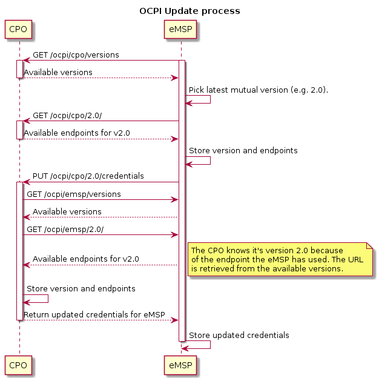

## Credentials endpoint

Identifier: credentials

Example: `/ocpi/cpo/2.0/credentials` and `/ocpi/emsp/2.0/credentials`

| Method   | Description                                                              |
| -------- | ------------------------------------------------------------------------ |
| GET      | Retrieves the client's credentials for the server's platform.            |
| POST     | Provides the server with credentials to the client's system (i.e. register). |
| PUT      | Updates the server's credentials to the client's system.                 |
| DELETE   | Informs the server that its credentials to the client's system are now invalid (i.e. unregister).  |


### Data

#### Credentials object

| Property         | Type                        | Card. | Description                                                   |
|------------------|-----------------------------|-------|---------------------------------------------------------------|
| token            | String                      | 1     | The token for the other party to authenticate in your system. |
| business_details | BusinessDetails             | 1     | Details of the other party.                                   |


### Example

```json
{
    "token": "ebf3b399-779f-4497-9b9d-ac6ad3cc44d2",
    "business_details": {
        "name": "Example Operator",
        "logo": "http://example.com/images/logo.png",
        "website": "http://example.com"
    }
}
```

### GET

Retrieves the client's credentials for the server's platform.

### POST

Provides the server with credentials to the client's system, this initiates the registration process. If successful, the server responds with the client's new credentials to the server's system.

### PUT

Updates the server's credentials to the client's system and switch to the version that contains this credentials endpoint. The server should also fetch the client's endpoints for this version.

If successful, the server responds with the client's (potentially updated) credentials to the server's system.

### DELETE

Informs the server that its credentials to the client's system are now invalid and can no longer be used. This is the unregistration process.

If successful, the server responds with an empty OCPI response message (i.e. `data` is null).

## Use cases

### Registration

To register a CPO in a eMSP platform (or vice versa), the CPO must create a unique token that can be used for authenticating the eMSP. This token along with the versions endpoint will have to be sent to the eMSP in some secure way that is outside the scope of this protocol.


Due to its symmetric nature, the CPO and eMSP can be swapped in the registration sequence.


### Updating to a newer version

At some point both parties will have implemented a newer OCPI version. To start using the newer version, one party has to send a PUT request to the credentials endpoint of the other party.




### Changing endpoints for the current version

This can be done by following the update procedure for the same version. By sending a PUT request to the credentials endpoint of this version, the other party will fetch and store the corresponding set of endpoints.
