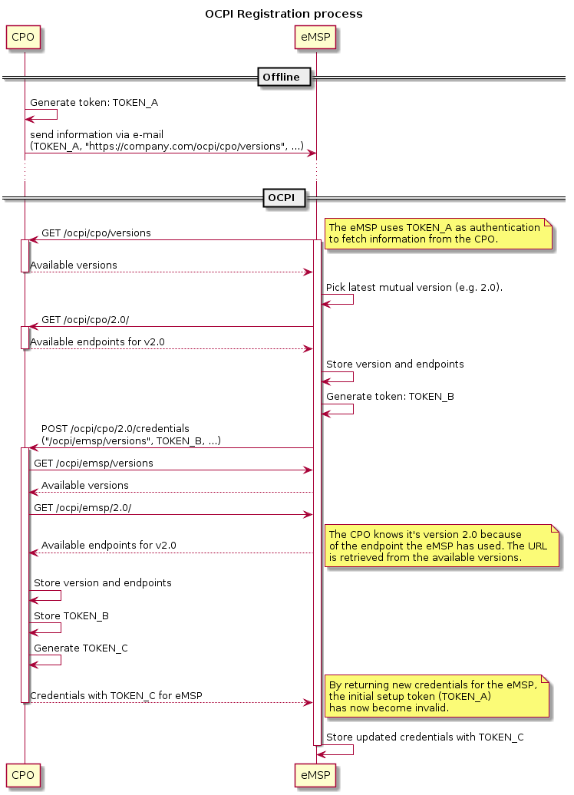

# Credentials endpoint

Identifier: `credentials`

Example: `/ocpi/cpo/2.0/credentials` and `/ocpi/emsp/2.0/credentials`


<div><!-- ---------------------------------------------------------------------------- --></div>
| Method   | Description                                                              |
| -------- | ------------------------------------------------------------------------ |
| GET      | Retrieves the client's credentials for the server's platform.            |
| POST     | Provides the server with credentials to the client's system (i.e. register). |
| PUT      | Updates the server's credentials to the client's system.                 |
| DELETE   | Informs the server that its credentials to the client's system are now invalid (i.e. unregister).  |
<div><!-- ---------------------------------------------------------------------------- --></div>

## Data

### Credentials object

<div><!-- ---------------------------------------------------------------------------- --></div>
| Property                 | Type                                                                   | Card. | Description                                                       |
|--------------------------|------------------------------------------------------------------------|-------|-------------------------------------------------------------------|
| token                    | String                                                                 | 1     | The token for the other party to authenticate in your system.     |
| url                      | [URL](types.md#14_url_type)                                            | 1     | The URL to your API versions endpoint.                            |
| business_details         | [BusinessDetails](mod_locations.md#41-businessdetails-class)           | 1     | Details of the other party.                                       |
| party_id                 | [string](types.md#16-string-type)(3)                                   | 1     | CPO or eMSP ID of this party. (following the 15118 ISO standard). |
| country_code             | [string](types.md#16-string-type)(2)                                   | 1     | Country code of the country this party is operating in.           |
<div><!-- ---------------------------------------------------------------------------- --></div>


### Example

```json
{
    "url": "https://example.com/ocpi/cpo/",
    "token": "ebf3b399-779f-4497-9b9d-ac6ad3cc44d2",
    "party_id": "EXA",
    "country_code": "NL",
    "business_details": {
        "name": "Example Operator",
        "logo": {
            "url": "https://example.com/img/logo.jpg",
            "thumbnail": "https://example.com/img/logo_thumb.jpg",
            "category": "OPERATOR",
            "type": "jpeg",
            "width": 512,
            "height": 512
        },
        "website": "http://example.com"
    }
}
```

## GET

Retrieves the client's credentials for the server's platform.

## POST

Provides the server with credentials to the client's system, this initiates the registration process. If successful, the server responds with the client's new credentials to the server's system.

## PUT

Updates the server's credentials to the client's system and switches to the version that contains this credentials endpoint. The server should also fetch the client's endpoints for this version.

If successful, the server generates a new token for the client and responds with the client's updated credentials to the server's system.

## DELETE

Informs the server that its credentials to the client's system are now invalid and can no longer be used. This is the unregistration process.

If successful, the server responds with an empty OCPI response message (i.e. `data` is null).

## Use cases

### Registration

To register a CPO in an eMSP platform (or vice versa), the CPO must create a unique token that can be used for authenticating the eMSP. This token along with the versions endpoint should be sent to the eMSP in a secure way that is outside the scope of this protocol.

`TOKEN_A` is given offline, after registration store the `TOKEN_C` which will be used in future exchanges. 

(In the sequence diagrams below we use relative paths as short resource identifiers to illustrate a point; please note that they should really be absolute URLs in any working implementation of OCPI)



Due to its symmetric nature, the CPO and eMSP can be swapped in the registration sequence.


### Updating to a newer version

At some point both parties will have implemented a newer OCPI version. To start using the newer version, one party has to send a PUT request to the credentials endpoint of the other party.


### Changing endpoints for the current version

This can be done by following the update procedure for the same version. By sending a PUT request to the credentials endpoint of this version, the other party will fetch and store the corresponding set of endpoints.

### Updating the credentials and resetting the token

The credentials (or parts theirof, such as the token) can be updated by sending the new credentials via a PUT request to the credentials endpoint of the current version, similar to the update procedure described above.

### Errors during registration

When the Server connects back to the client during the credentials registration, it might encounter problems. When this happens, the Server should add the status code: [3001](status_codes.md#3xxx-server-errors) in the response to the POST from the client. 

### Required endpoints not available

When two parties connect, it might happen that one of the parties expects a certain endpoint to be available at the other party. 

For example: a CPO could only want to connect when the CDRs endpoint is available in an eMSP system. 

In case the client is starting the credentials exchange process and cannot find the endpoints it expects. Then, it is expected NOT to send the POST request with credentials to the server. Log a message/notify the administrator to contact the administrator of the server system.

In case the server, receiving the request from a client, cannot find the endpoints it expects, then it is expected to respond to the request with a status code: [3003](status_codes.md#3xxx-server-errors).
