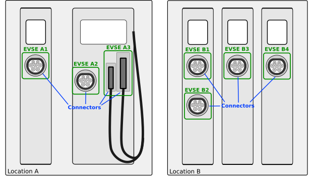

# Terminology and Definitions

## Abbreviations

 * **OCPI** Open Charge Point Interface
 * **CDR** Charge Detail Record
 * **CPO** Charging Point Operator
 * **eMSP** e-Mobility Service Provider

## Provider and Operator abbreviation
In OCPI it is advised to use eMI3 compliant names for Contract IDs and EVSE IDs. The provider and the operator name is important here, in order to target the right provider or operator, they need to be known upfront, at least between the cooperating parties. 

In several standards, an issuing authority is mentioned that will keep a central registry of known Providers and Operators. 
At this moment, the following countries have an authority that keeps track of the known providers and operators:

### The Netherlands

The Dutch foundation, named [eViolin](http://www.eviolin.nl) keeps the registry for The Netherlands. 

 * The list of operator IDs and provider IDs can be viewed on their website [eViolin/Leden](http://www.eviolin.nl/index.php/leden/). 

### Germany

The BDEW organisation keeps the registry for Germany in their general code number service [bdew-codes.de](https://bdew-codes.de/).

 * [Provider ID List](https://bdew-codes.de/Codenumbers/EMobilityId/ProviderIdList) See https://bdew-codes.de/Codenumbers/EMobilityId/ProviderIdList
 * [EVSE Operator ID List](https://bdew-codes.de/Codenumbers/EMobilityId/OperatorIdList)  See https://bdew-codes.de/Codenumbers/EMobilityId/OperatorIdList

### Austria

Austrian Mobile Power GmbH maintains a registry for Austria. This list is not publicly available.
For more information visit [austrian-mobile-power.at](http://austrian-mobile-power.at/tools/id-vergabe/information/)

### France
The AFIREV* organisation will keep/keeps the registry for France. It provides operation Id for CPO and eMSP in compliance with eMI3 id structure. The prefix of these Ids is the “fr” country code. AFIREV will also be in charge of the definition of EVSE-Id structure, Charging-Pool-Id structure (location), and Contract-Id structure for France. AFIREV bases its requirements and recommendations on eMI3 definitions.
 
AFIREV stands for: Association Française pour l’Itinérance de la Recharge Électrique des Véhicules

## Charging topology

The charging topology, as relevant to the eMSP, consists of three entities:

* *Connector* is a specific socket or cable available for the EV to make use of.
* *EVSE* is the part that controls the power supply to a single EV in a single session. An EVSE may provide multiple connectors but only one of these can be active at the same time.
* *Location* is a group of one or more EVSEs that belong together geographically or spatially.

A Location is typically the exact location of one or more EVSEs, but it can also be the entrance of a parking garage or a gated community. It is up to the CPO to use whatever makes the most sense in a specific situation. Once arrived at the location, any further instructions to reach the EVSE from the Location are stored in the EVSE object itself (such as the floor number, visual identification or manual instructions).

## Variable names

In order to prevent issues with Capitals in variable names, the naming in JSON is not CamelCase but snake_case. All variables are lowercase and include an underscore for a space.

## Cardinality

When defining the cardinality of a field, the following symbols are used during the document:

<!-- ---------------------------------------------------------------------------- -->

| Symbol | Description                     | Type     |
|--------|---------------------------------|----------|
| ?      | An optional object.             | Object   |
| 1      | Required object.                | Object   |
| *      | A list of zero or more objects. | [Object] |
| +      | A list of at least one object.  | [Object] |

<!-- ---------------------------------------------------------------------------- -->

